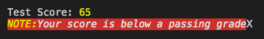
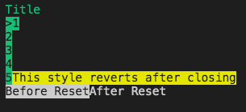

# TermColor

Rule-based text coloring/styling library for terminal text

[](https://badge.fury.io/rb/term_color)

## Overview

### Justifying Features

- Define named text style rules once, combining fg/bg color and styling that can be reused through out application
    - Able to manually specify what gets reset after style use is finished in a line, which parts to reset, etc.
- Streamline including multiple styles within a single string, including allowing nested rules

### Requirements

- Tested/developed for Ruby 2.6.1

## Concepts/Syntax

Rules are grouped into `RuleSets`, which are represented by instances of {TermColor::RuleSet}. Rules are applied to text using tag strings indicating start and end of rule application. There is also a tag that can be used outside of rule application to fully reset all styling options to system default.

### Tags

_The 'tag' strings used to specify start and end of ranges of text to apply a rule to can be customized in the `RuleSet` constructor. These details assume the defaults are used._

- Open: `{%<rule name>`
    - Ex: ``
- Reset: `%@`
    - Only usable outside of tags. Resets all styling to default even if a previously used rule is configured to keep styling applied after close

```ruby
# Rules named :a and :b
"Unstyled  Normal  normal %@ fully reset"
```

Rules can be nested. When an inner rule tag is closed, the styling of the any outer/unclosed tags will be re-applied from outer most to inner most.

```ruby
"{%aRule A{%bRule A+BA+B%}A%} Normal"
```

### Rule Sets

Rule Sets contain named styling rules, any override options you chose to use (`after` behavior, open/close/reset symbols). Instances of `RuleSet` also provide methods for processing and displaying text with style tag markup via methods like `print` and `printf`

Gemeral Usage:

```ruby
rs = TermColor.create_rule_set(<rules hash>, <named options>)
```

Constructor:

```ruby
rules = {
    # Rule named :title
    title: { fg: :yellow, enable: :underline }
}
# Create instance of RuleSet
rule_set = TermColor.create_rule_set(rules)
# or
rule_set = TermColor::RuleSet.new(rules)
```

#### Constructor Options

- `after` - Override default 'after' rule (controlling what gets reset after a style tag is closed). Default is `:auto`, which automatically determines what styling to removed based on the rule being closed
    - `:reset` - Causes all colors and styling to be reset on close
    - `:keep` - Causes nothing to get reset
    - Custom Hash - Allows you to specify your own after rule as a hash containing properties valid for `after` sections (`[:fg,:bg,:reset,:enable,:disable]`)

#### Applying to Text

Once you've got a `RuleSet` instance, calling its `apply` or `print`/`printf` methods with a string parameter will give back a copy of that string with styles applied

__Methods__

- `apply` - {TermColor::RuleSet#apply}
- `print` - {TermColor::RuleSet#print}
- `printf` - {TermColor::RuleSet#printf}

### Rule Definitions

A Rule definition is a hash consisting of two parts, `inside` and `after`. `inside` dictates styling that gets applied to text between the open and close tags for the rule, `after` allows you to override what happens when that tag closes (overrides default `after` rule as specified in constructor).

The `after` part, when used, must always be a hash in the rule definition assigned to the key `:after`. Everything else will be automatically grouped into a `inside` key/value if not explicitly specified.

```ruby
r = { inside: { fg: :red }, after: { keep: :fg }}
r = { fg: :red, bg: :blue }
r = { after: { reset: :all}  }
```

### Rule Options/Actions

#### Colors

##### Attributes

- `fg` - Change foreground color
- `bg` - Change background color

##### Values

###### Standard Named Colors

Color values can be color-name symbols as defined in {TermColor::Rule::Colors} (`:black, :red, :yellow, :blue, :magenta, :cyan, :white`)

###### XTerm 256 Color Values

To use XTerm 256 Color Mode values, include the color code integer inside a single item array. (E.g. for code `208`, use `[208]`)

###### XTerm 16m Color Values

To use XTerm 16m Color Mode RGB colors, include the red, green and blue color values in an ordered array (E.g. for 80 red, 80 green, 255 blue, use `[80,80,255]`)

#### Styles

##### Actions

- `enable` - Style(s) to enable (Can be single item or array)
- `disable` - Style(s) to disable (Can be single item or array)

##### Values

(See symbols in {TermColor::Rule::Styles})

- `:bold`/`:intense`
- `:dim`/`:dark`
- `:italic`
- `:underline`
- `:inverse`
- `:hidden`
- `:strikethrough`

#### Reset / Keep

_(Only valid in `after` section)_

Quick way of resetting one or more style rules. `reset`/`keep` can be given a single symbol or an array of symbols.

`keep` will be ignored if included in default after rule

```ruby
{ reset: [options] }
{ keep: [options] }
```

#### Options

- `:fg` / `:bg` - Reset foreground / background color
- `:style` - Reset all styling
- `:all` - Reset all colors and styling

[If example images are missing, view readme on github](https://github.com/vdtdev/term_color/blob/master/README.md)

## Examples

_If images don't show up, try viewing on [Github](https://github.com/vdtdev/term_color/blob/master/README.md)_

### Basic w/ Nesting (`:auto` after mode)

```ruby
rule_set = TermColor.create_rule_set({
    yellow: { fg: :yellow },
    ul: { enable: :ul },
    err: { fg: :white, bg: :red, enable: [:italic] }
})

rule_set.print "Test Score: \n"
rule_set.print "{%ul{%err" +
    "Your score is below a passing grade%}X%}\n"
```




### With `:keep` after mode

```ruby
rule_set = TermColor.create_rule_set({
    g: { fg: :green },
    i: { enable: :inverse },
    f: { fg: :yellow, after: { reset: :fg }}
}, after: :keep)

rule_set.print "\n"
rule_set.print ""
(1..5).each {|i| print "#{i}\n" }
rule_set.print "\n"
rule_set.print "Before Reset%@After Reset\n"
```




## License

(c) 2020, Wade H. (vdtdev.prod@gmail.com). All Rights Reserved. Released under MIT license.