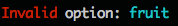

# TermColor

Rule-based text coloring/styling library for terminal text

## Overview

### Justifying Features

- Define named text style rules once, combining fg/bg color and styling that can be reused through out application
    - Able to manually specify what gets reset after style use is finished in a line, which parts to reset, etc.
- Streamline including multiple styles within a single string, including allowing nested rules

### Requirements

- Tested/developed for Ruby 2.6.1

## Concepts/Syntax

Rules are grouped into `RuleSets`, which are represented by instances of {TermColor::RuleSet}.

### Rule Set

A set is constructed from a Hash of rule, where they keys are rule names and the values are the rule definition hashes.

```ruby
rules = {
    # Rule named :title
    title: { fg: :yellow, enable: :underline }
}
# Create instance of RuleSet
rule_set = TermColor.create_rule_set(rules)
# or
rule_set = TermColor::RuleSet.new(rules)
```

#### Applying to Text

Once you've got a `RuleSet` instance, calling its `apply` or `print`/`printf` methods with a string parameter will give back a copy of that string with styles applied

__Methods__

- `apply` - {TermColor::RuleSet#apply}
- `print` - {TermColor::RuleSet#print}
- `printf` - {TermColor::RuleSet#printf}

__Use__

- To apply a style to a section of the input string, surround it with `%rule_name` and `%%`
    - E.g.: `"%titleTitle Text%%"`
    - `%%` indicates the end of rule application, after which any `after` rules will get applied
    - Including `%%` when no rule is active will apply the `default` rule's `:after` options, which can either be overridden in your rule set, or make use of the built-in version which simply resets all colors and text styling to system default
- Rule application can be nested (`"%titleTitle of %otherBook%%%%"`)

### Rule Definitions

Rule definitions are just hashes that include rule options. The included options can be divided into `:inside` (applied to text rule is applied to) and `:after` (applied to text following text rule is applied to). If neither of these sub hashes are included, all options are treated as being for `:inside`, and an `:after` set is auto-generated to unapply style changes made inside rule for following text. To prevent an `:after` section from being automatically generated, either include your own `:after` section or include `after: {}`. 

```ruby
# No groups, after will be generated
rule = { fg: :red }
# Same as above but with groups. after will be generated
rule = { inside: { fg: :red } }
# No groups, skip after generation by setting it to 
# empty hash of options
rule = { fg: :red, after: {} }
# Both groups, same as others but with explicitly set after options,
# no auto-generation
rule = { inside: { fg: :red }, after: { reset: :fg } }
```

For more details on rule definitions, see {file:docs/rule_dsl.md Rule DSL}

## Examples

### Basic

```ruby
rule_set = TermColor.create_rule_set({
    opt: { fg: :cyan },
    err: { fg: :red }
})

rule_set.printf "%errInvalid%% option: %opt%s%%\n", "fruit"
```




### Nested /w XTerm RGB

```ruby
rule_set = TermColor.create_rule_set({
    title: { fg: :yellow, enable: :underline },
    emph: { fg: [0xa0,0xa0,0xff], enable: :italic },
    author: { fg: :green, bg: :blue, enable: :bold }
})

rule_set.print "book: %%titleHarry Potter (%emph%%)%% by %authorJ. K. Rowling%%\n"
```

## License

(c) 2020, Wade H. (vdtdev.prod@gmail.com). All Rights Reserved. Released under MIT license.